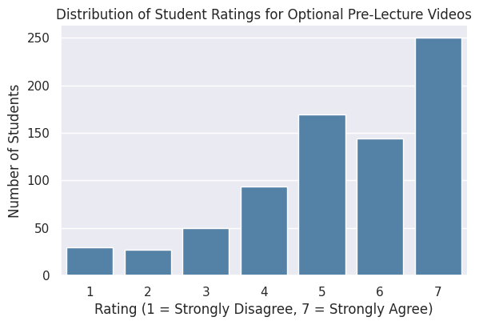
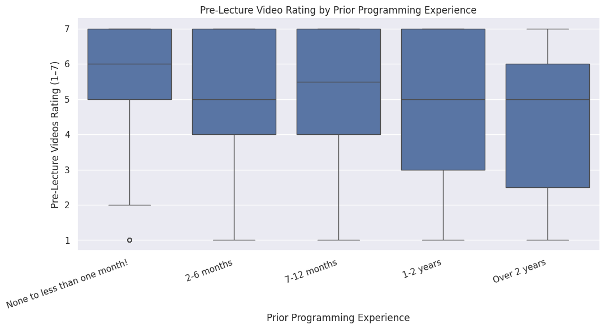
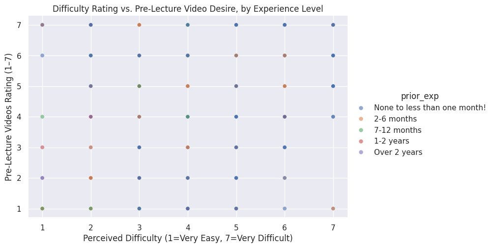

# EX09: Data Analysis for Continuous Improvement

**Author:** Vedant Mehta | COMP110 Spring 2026

---

## Analysis Summary

I analyzed two columns from the anonymized COMP110 course survey: `prior_exp` (prior programming experience level) and `pre_lecture_videos` (1–7 Likert rating of how helpful optional pre-lecture videos would be).

After combining both survey datasets and filtering out incomplete responses, I compared how students across different experience levels rated the idea. I also examined whether perceived course difficulty correlated with demand for pre-lecture videos.

**Key finding:** Students with no prior programming experience rated the idea of optional pre-lecture videos higher on average than students with 2+ years of experience. Students who found the course more difficult also tended to want pre-lecture videos more, suggesting the same population is driving demand.

---

## Visualizations

### 1. Overall Distribution of Pre-Lecture Video Ratings

### 2. Pre-Lecture Video Rating by Prior Experience Level

### 3. Difficulty vs. Pre-Lecture Video Desire by Experience Level

---

## Conclusion

The data moderately supports the idea. Novice students consistently rated optional pre-lecture videos more favorably than experienced students. Since experienced students are largely indifferent, making videos optional means they cost nothing for that group while providing real value to beginners.

**Trade-offs to consider:**
- Creating videos adds significant workload for instructional staff
- Optional content may become de facto required in students' minds
- Students with experience showed lower interest

**Future directions:**
- Target videos only to students who self-identify as beginners at enrollment
- Track whether video-watchers show improved understanding scores mid-semester
- Test alternative low-cost formats like short readings or interactive code examples